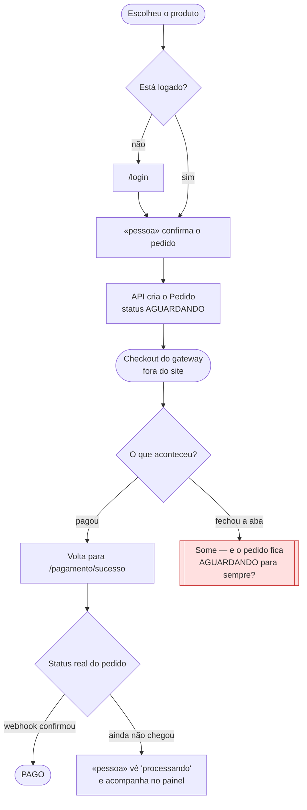
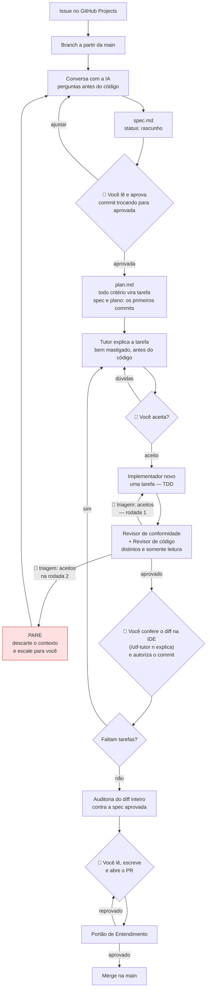

# Guia da Disciplina: UTF-SDD — Desenvolvimento Dirigido por Especificação, por Portões

Este documento explica o método de trabalho da disciplina. Leia antes da primeira
entrega e volte a ele sempre que tiver dúvida sobre "como eu deveria estar fazendo
isso".

---

## 1. Por que existe um método

Pedir código para uma Inteligência Artificial é fácil. Qualquer pessoa consegue, em
cinco minutos, gerar uma tela funcionando. O problema aparece semanas depois: o
sistema faz coisas que ninguém pediu, ninguém lembra o porquê de uma regra existir
e, quando é preciso alterar algo, a vontade é apagar tudo e recomeçar.

O método desta disciplina existe para resolver esse caos. A regra de ouro é:

> **A IA escreve o código. Você continua responsável por cada decisão.**

Para materializar isso, adotaremos o **Spec-Driven Development (SDD)** — ou
Desenvolvimento Dirigido por Especificação — como metodologia central, na
variante desta disciplina: o **UTF-SDD**, um **SDD por Portões** (*Gated SDD*).
O que o distingue dos SDDs de mercado são três compromissos: **nada avança sem
um portão de decisão humana registrada** (aprovar a spec e o plano, aceitar a explicação
do tutor, triar apontamentos, autorizar cada commit — quatro por história — e um
quinto ao abrir o Pull Request); **quem revisa nunca é
quem escreveu** (implementador de contexto limpo, revisores somente-leitura,
auditor final); e **todo artefato é evidência para a defesa** — pareceres,
decisões e commits existem para provar que você entendeu o que assinou. É o
*architect-in-the-loop*: a IA é a equipe; o arquiteto do sistema é você.

Você não será avaliado por conseguir gerar código rápido. Sua avaliação será baseada
na sua capacidade de aplicar o SDD para dirigir a IA, auditar o que ela gerou e
explicar as decisões técnicas. **Você é o Engenheiro e o Arquiteto; a IA é a sua
equipe de execução.** Na prática, assumir esse papel significa que o **Arquiteto**
define os contratos (PRD), a estrutura e as regras do sistema, enquanto o
**Engenheiro** audita o código gerado, exige testes automatizados, valida a segurança
e assume a responsabilidade técnica. A IA apenas traduz as suas decisões em sintaxe.

> 💡 **Nenhuma ferramenta paga é necessária para cursar a disciplina.** O método
> descrito aqui funciona em qualquer assistente de código que aceite regras de projeto
> e subagentes — inclusive nas combinações gratuitas listadas no Apêndice A. Espere
> apenas mais lentidão e mais rodadas de correção, o que se compensa fatiando as
> histórias em pedaços menores.

### 1.1 A stack da disciplina

- **Backend:** NestJS. É o que você está aprendendo aqui, e boa parte do guia usa
  exemplos dele.
- **Frontend:** sua escolha entre **React, Angular ou Vue**. A escolha é sua, mas é
  única e definitiva para o semestre — trocar no meio invalida o `architecture.md` e
  todas as specs que apontam para ele.

O método não muda com a escolha. O que muda são os nomes das camadas, e é justamente
por isso que existe o `docs/architecture.md`: para escrever, uma vez, quais são elas.

---

## 2. Os artefatos

Todo trabalho gira em torno de doze artefatos. Eles são a matéria-prima da sua nota.

| Artefato | Onde fica | Para que serve |
| --- | --- | --- |
| **`README.md`** | raiz | A vitrine: o que é, quem fez, como rodar, link em produção. |
| **`prd.md`** | `docs/` | O que o produto faz: glossário, atores, histórias. |
| **`architecture.md`** | `docs/` | Onde as coisas estão: estrutura, entidades, estados, contratos. |
| **`checklist.md`** | `docs/` | A ficha da disciplina: regras do projeto, IDs e entregas — a régua dos workflows. |
| **`user-flows.md`** | `docs/` | O que a pessoa vive na tela, e onde ela desiste. |
| **`design-tokens.md`** | `docs/` | Cores, espaçamento, tipografia — para a IA não inventar um botão por tela. |
| **Issue** | GitHub Projects | A unidade de trabalho. Uma história de usuário. |
| **`spec.md`** | `specs/<issue>-<slug>/` | O que precisa existir e como saber que ficou pronto. |
| **`plan.md`** | `specs/<issue>-<slug>/` | Como será construído, em tarefas pequenas. |
| **Pareceres de revisão** | `specs/<issue>-<slug>/reviews/` | O que cada revisor apontou, sem edição. É a prova de que a revisão aconteceu. |
| **Código** | `apps/api`, `apps/web` | O que a IA escreve seguindo o plano. |
| **Pull Request** | GitHub | Onde você explica, com suas palavras, o que foi feito. |

Desses doze itens, a IA produz sozinha apenas **o código, o plano e os pareceres**.
A ficha vem pronta com o template; todo o resto precisa da sua direção.

E existe um décimo-terceiro, que é um índice e não um artefato: o `specs/README.md`,
descrito no fim do §4.

---

## 3. Fase 0 — a visão geral, antes do primeiro ciclo

Antes de codificar a primeira Issue, você estabelece o entendimento compartilhado do
projeto. São **quatro documentos e um conjunto de tokens visuais**, produzidos uma
única vez e mantidos vivos daí em diante.

A ordem operacional da fase, com o comando que conduz cada etapa e o portão que a
fecha:

| # | Etapa | Comando | 🚪 Portão |
| --- | --- | --- | --- |
| 1 | Requisitos (`docs/prd.md`) | `/utf-prd` | Você lê, ajusta e **commita**; o professor aceita o tema |
| 2 | Backlog (Issues no GitHub + o roteiro do Kanban, que você monta) | `/utf-backlog` | Você aprova a lista de Issues **antes** de elas serem criadas |
| 3 | Jornadas e tokens (`docs/user-flows.md`, `docs/design-tokens.md`) | `/utf-flows` | Você decide o que acontece em cada ponto de desistência e **commita** |
| 4 | Arquitetura (`docs/architecture.md`) | `/utf-architecture` | Você lê e **commita** |
| 5 | Scaffold (`apps/`, verde) | `/utf-setup` | Ratificações + o primeiro PR (`manutencao`) |

A etapa 3 vem **antes** da arquitetura de propósito: um nó vermelho quase sempre revela
um estado que faltava (*"o pedido fica AGUARDANDO para sempre?"*), e estado é matéria do
`architecture.md`. Desenhar a jornada depois é descobrir o estado com o documento já
fechado.

Os comandos são entrevistas: **uma pergunta por vez, quem decide é você** — o agente
organiza e escreve. As seções seguintes explicam o que cada documento contém e por quê.

Não é burocracia de início de semestre. É que **o ciclo por Issue amplifica o
contexto que existe**. Se há um PRD com glossário e um documento de arquitetura, cada
especificação nasce coerente com o resto do sistema. Se não há, cada Issue vira um
projeto novo: o agente inventa o nome da entidade, escolhe sozinho onde a regra mora,
decide um formato de resposta diferente. Na quinta Issue você tem três jeitos de fazer
a mesma coisa — e nenhum deles está errado isoladamente, o que torna o problema
difícil de enxergar e caro de desfazer.

### 3.1 `README.md` — a vitrine

Fica na raiz e é a primeira coisa que qualquer pessoa lê. Contém:

- Título do projeto e autores
- Uma frase dizendo o que o sistema faz
- Stack tecnológica
- **Link da aplicação em produção**
- **Quick Start**: os comandos para clonar, instalar, subir o banco e rodar
- A tabela de variáveis de ambiente — **nome e para que serve, nunca o valor**

Se alguém entrar na equipe amanhã, é o README que coloca o projeto rodando na máquina
dessa pessoa. Tudo que for "como executar" vive aqui, e em nenhum outro lugar.

### 3.2 `docs/prd.md` — o que o produto faz

**PRD (Product Requirements Document):** define o escopo do produto. Deve conter a
visão, as histórias de usuário (com status de rascunho até concluído) e um rigoroso
**Glossário Ubíquo**.

**Visão e objetivo.** Um ou dois parágrafos: que problema o sistema resolve, para quem.

**Glossário ubíquo.** A parte mais subestimada do PRD, e a que mais economiza tempo
depois. Uma tabela com o termo do negócio, em português, o que ele significa e com o
que **não** se confunde:

| Termo | Significa | Não confundir com |
| --- | --- | --- |
| Pedido | Os itens que o cliente fechou e precisa pagar | Carrinho (ainda aberto), Orçamento (ainda não aceito) |
| Pagamento | Uma tentativa de quitar um pedido junto ao gateway | Pedido (um pedido pode ter várias tentativas) |

Tecnologia não entra aqui. A ponte entre esses termos e o nome da entidade no código
(`Order`, `Payment`) é o glossário técnico do `architecture.md` (§3.3) — um lugar só,
para não duplicar. Sem o glossário, a IA cria `Pedido`, `Order` e `ServiceRequest` na
mesma base, em semanas diferentes, e cada um parece razoável no contexto em que nasceu.

**Atores e permissões.** Quem usa o sistema e o que cada perfil pode fazer.

**Histórias de usuário**, com critérios de aceitação e um status explícito:

- ⚪ **Draft** — ideia em rascunho, as regras ainda estão sendo escritas. **Não codificar.**
- 🟡 **Ready** — regras definidas, pronta para virar Issue.
- 🟢 **Live** — implementada, testada e funcionando.

O status é um portão barato: o agente não implementa história meio pensada porque a
própria história diz que não está pronta. E, de quebra, a lista de status é o mapa do
que já existe e do que ainda falta no projeto.

### 3.3 `docs/architecture.md` — onde as coisas estão

> ⚠️ **Por que não se chama `sdd.md`.** Nesta disciplina, SDD já significa
> **Spec-Driven Development**. A mesma sigla valendo duas coisas dentro do repositório
> confunde você e confunde o agente — é o tipo de ambiguidade que faz um documento
> apodrecer sem ninguém notar. O papel é o de Software Design Document; só o nome
> deixou de ser ambíguo.

Contém:

- **Stack tecnológica e ambiente.** Os frameworks e paradigmas. *Declare a tecnologia
  e a linha principal de cada framework aqui; a versão exata das bibliotecas vive no
  `package.json`.*
- **Estrutura do monorepo.** Que pasta guarda o quê — `apps/api` em NestJS,
  `apps/web` no framework que você escolheu.
- **Diagrama de contexto (opcional).** Quem é o front, quem é o back, banco e
  integrações externas. Trata o seu sistema como caixa preta e ilustra quem o usa e
  com que sistemas externos ele conversa (Google OAuth, gateway de pagamento, sistema
  da UTFPR).
- **Modelo de dados (diagrama ER).** As tabelas principais e seus relacionamentos.
- **Glossário técnico (PT-BR → EN).** A ponte que garante que o PRD em português
  ("Aplicação") vire a entidade correta em inglês no código e no banco (`apps`),
  matando o código espanglês.
- **Padrões arquiteturais.** O paradigma adotado e como as camadas se comunicam.
- **Padrão de comunicação (API).** O formato global inegociável de entrada e saída.
- **Segurança e autenticação.** A estratégia global de defesa.

#### O que decidir no backend NestJS

Estas quatro decisões precisam estar escritas, com essas palavras, porque são as que o
agente mais inventa sozinho quando o documento é omisso:

| Decisão | Pergunta que o documento responde | Exemplo de resposta escrita |
| --- | --- | --- |
| **Camadas** | O Controller pode tocar o banco? | "O Controller só fala com o Service. O Service é o único que fala com o Repository. Controller nunca injeta Repository." |
| **Entrada** | Onde a validação acontece? | "Todo corpo de requisição é um DTO com `class-validator`. `ValidationPipe` global com `whitelist: true`." |
| **Saída** | Qual o envelope de sucesso e de erro? | "Sucesso: `{ data: ... }`. Erro: `{ statusCode, message }`, sempre via `HttpException`." |
| **Autenticação** | Como o sistema sabe quem é o usuário? | "JWT no header `Authorization`. Rotas protegidas por `@UseGuards(JwtAuthGuard)`. O front guarda o token em [onde]." |

#### O que decidir no frontend, independente do framework

A regra que mais importa é a mesma nos três:

> **Componente não fala com o servidor.** Existe uma camada de serviço/repositório
> entre a tela e a API. O componente pede dados a ela e não sabe que HTTP existe.

Escreva no `architecture.md` como essa camada se chama no seu framework (`service`
injetável no Angular, hook ou módulo de API no React, composable ou store no Vue) e
onde ela mora na árvore de pastas. Sem isso, metade das telas vai chamar `fetch`
direto e a outra metade não.

#### O que o documento NÃO contém (anti-padrões)

- 🚫 **Versões exatas de bibliotecas.** O documento declara a **linha principal** de
  cada framework ("NestJS 11", "Angular 20") — é dela que o `/utf-setup` escolhe o
  gerador e que os padrões de código dependem. O pin exato (`11.0.7`) vive só no
  `package.json`: versão de patch escrita em prosa envelhece em silêncio, e algum
  subagente confia no texto em vez do lockfile.
- 🚫 **Detalhes de funcionalidades.** Diagramas de sequência específicos, máquinas de
  estado isoladas e DTOs de endpoints. Tudo isso é criado sob demanda no `spec.md` de
  cada história. Colocar aqui polui o documento e estoura a janela de contexto da IA
  à toa.

### 3.4 `docs/user-flows.md` — o que a pessoa vive na tela

**O que é:** o desenho do caminho que o usuário percorre, do primeiro clique até o
objetivo — **incluindo os pontos onde ele trava, espera ou desiste**.

#### Por que isso não aparece sozinho

Em todo fluxo, **o caminho feliz é óbvio e os caminhos ruins não são**. E os testes
automatizados não salvam: você escreve teste para o que imaginou, e o problema é
justamente o que não imaginou.

Cinco situações que acontecem de verdade em projetos como o seu:

**O Pix que demora.** Você testa com cartão, que aprova na hora, e está tudo certo. Na
apresentação, alguém paga com Pix. O usuário volta ao site e vê "aguardando
pagamento", espera cinco segundos, acha que falhou e **paga de novo**. Agora há dois
pagamentos para um pedido.

**O cadastro que prende o usuário.** Cadastro em duas etapas: informa o e-mail, recebe
o link, completa o perfil. A pessoa fecha o navegador antes de confirmar. Uma semana
depois tenta se cadastrar: "e-mail já cadastrado". Tenta entrar: "usuário não
confirmado". Ela está presa, e não existe nenhum botão na tela que a tire dali.

**A sessão que expira no formulário longo.** O usuário preenche vinte campos durante
quinze minutos, clica em salvar, o token já expirou, a API devolve 401, o interceptor
manda para o login — e **o formulário inteiro se perde**. A pergunta que a jornada
força: a sessão é verificada ao abrir o formulário ou só ao enviar?

**A regra que só aparece no fim.** O usuário escolhe o serviço, preenche tudo, e só ao
enviar o servidor responde "você precisa ter um item cadastrado antes". A checagem
tinha que estar na porta, não na saída.

**O login que perde o contexto.** A pessoa está navegando anônima, encontra um item,
clica em "favoritar", é mandada ao login, entra — e cai na home. Perdeu o que estava
fazendo e provavelmente desiste.

#### Quando vale a pena escrever a jornada

Não é para todo fluxo. Um CRUD de listagem não precisa de diagrama nenhum. **Vale
escrever quando o fluxo tem pelo menos uma destas quatro características:**

1. **Sai do seu site e volta** — checkout, login social, confirmação por e-mail
2. **Depende do tempo** — algo pode demorar, expirar ou chegar fora de ordem
3. **Depende de outra pessoa agir** — uma aprovação, uma moderação, um parceiro aceitar
4. **Pode ser abandonado no meio** — formulário longo, cadastro em etapas

Repare que o **pagamento marca as quatro ao mesmo tempo**. É por isso que ele é o
exemplo canônico.

#### O que se exige nesta disciplina

**Pelo menos uma jornada**, da história que você julgar mais crítica no seu projeto.
Se estiver em dúvida sobre qual escolher, use a **jornada de pagamento** — todo projeto
tem uma, e ela marca os quatro critérios.

Uma jornada bem feita vale mais que três superficiais. O objetivo aqui é aprender a
enxergar o caminho ruim, não produzir documentação por volume.

#### Como desenhar

Três convenções, só:

- **Losango** — decisão do sistema (validação, guard, verificação de estado)
- **Retângulo com `«pessoa»`** — ação de quem está na tela
- **Nó vermelho** — onde a pessoa some



Abaixo do diagrama, escreva **um parágrafo** dizendo o que você fez a respeito do nó
vermelho. Esse parágrafo é o que transforma o desenho em decisão de projeto — e é o que
o professor vai pedir para você explicar na defesa.

Desenhe a jornada **antes** de implementar. Olhe para o nó vermelho: é ele que responde
as duas perguntas que quebram a maioria das integrações de pagamento — o que acontece
quando o usuário fecha a aba, e quem realmente decide que o pedido foi pago.

> ⚠️ **A jornada só vira software se virar critério de aceite.** O nó vermelho que você
> desenhou aqui precisa reaparecer, mais tarde, como uma linha verificável no `spec.md`
> da história correspondente. Se ele ficar só no diagrama, ninguém escreve teste para
> ele e ele volta no dia da apresentação. Veja o Passo 2 do §4.

### 3.5 Tokens de design e protótipo

Não se espera um design system completo — isso não cabe em 30 horas. O que resolve o
problema real, que é a IA inventar um botão diferente a cada tela, é bem menor:

- **Um arquivo de tokens** em `docs/design-tokens.md`: paleta de cores com nome
  semântico, escala de espaçamento, tipografia e estados de botão
- **De três a cinco telas** do protótipo, das principais jornadas

Com isso no repositório, a prototipagem assistida por IA tem a que obedecer. Sem isso,
cada tela nasce de um gosto diferente.

Os dois artefatos desta seção e da anterior saem do mesmo comando, o `/utf-flows`.

### 3.6 A regra de ouro dos documentos

> **Nada é duplicado entre eles.**

Informação repetida em dois lugares diverge — sempre, e sem avisar. Um dos dois
envelhece enquanto continua parecendo verdade, e é justamente nele que alguém vai
confiar.

| Arquivo | Responde |
| --- | --- |
| `README.md` | **como rodar** — instalação, execução, link em produção |
| `docs/prd.md` | **o que o produto faz** — histórias, critérios e o que já está pronto |
| `docs/architecture.md` | **onde as coisas estão** — estrutura, entidades, contratos, estados |
| `docs/user-flows.md` | **o que a pessoa vive** — jornadas e pontos de desistência |
| `docs/design-tokens.md` | **como o produto se parece** — paleta, espaçamento, tipografia |
| `docs/checklist.md` | **o que a disciplina exige** — regras, IDs e entregas |
| `specs/` | **o que está sendo construído agora** — uma pasta por história |

Se você precisa saber o status do pedido, existe **um** lugar: a máquina de estados no
`architecture.md`. Quem precisar dela em outro documento aponta para lá, não copia.

### 3.7 O portão da Fase 0

A Fase 0 mais o setup (§3.8) são a **Entrega 1 — Planejamento e Setup**. Os
artefatos são revisados antes de você abrir a primeira Issue de implementação; a
primeira spec já conta para a Entrega 2.

Depois dela, a lógica se inverte: documentação deixa de ser etapa e passa a andar junto
de cada PR, atualizada no mesmo commit que muda o comportamento. A Fase 0 é o único
momento do semestre em que você descreve um sistema que ainda não existe. Daí em
diante, a documentação nunca anda na frente do código: ela muda no mesmo commit que
muda o comportamento.

O `spec.md` também vem antes do código, mas ele não é documentação — é a ordem de
serviço. Documentação descreve o que existe; spec descreve o que deve passar a existir.
Por isso uma envelhece se não for atualizada, e a outra não: a spec cumpre seu papel no
dia em que o PR é mesclado.

### 3.8 Entre a Fase 0 e a primeira Issue: o setup

Existe um trabalho que não é documento nem história: gerar o monorepo. As pastas de
app pelos geradores oficiais da stack, os scripts da raiz, a etiqueta `manutencao`, a
proteção da `main` e o índice de specs. (O template de PR e o Portão de Entendimento já
vêm no repositório criado a partir do template — o setup só confere que estão lá.)

Ele **não tem spec**, e o motivo é o teste de uma linha do §4: ninguém demonstra um
scaffold para alguém que não programa. Logo, não é história — é a primeira **Task de
manutenção** do projeto, e o candidato natural a primeiro Pull Request, com a etiqueta
`manutencao`.

Mas ele precisa vir antes do primeiro `/utf-issue`, por uma razão que o próprio método
impõe: **o RED do TDD só significa algo num repositório onde a suíte de testes já
roda.** Um teste que falha porque o critério ainda não foi implementado é informação;
um teste que falha porque não existe runner instalado é ruído — e o ciclo não distingue
os dois sozinho.

Empacote esse trabalho num comando (`/utf-setup`), com três regras:

1. **Ele lê a stack do `architecture.md`, não decide.** O que o documento não declara,
   o comando pergunta.
2. **Ele roda uma vez.** Se as pastas de app já existem, ele para em vez de sobrescrever.
3. **Ele termina onde o negócio começa.** Nenhuma entidade do glossário do PRD vira
   código no setup. A suíte nasce verde e vazia de regras — as regras chegam pela
   primeira Issue, com spec aprovada.

---

## 4. O ciclo completo

Vamos usar um exemplo real que você vai enfrentar: *"o usuário precisa pagar o pedido"*.

### Passo 1 — Da ideia para a Issue

Você quebra o PRD em histórias de usuário e as leva para o GitHub Projects.
Uma Issue = uma coisa que o usuário consegue fazer. Para as **Features**, esse
transporte é o `/utf-backlog` (Fase 0, etapa 2): uma Issue por story `Ready`,
com a lista aprovada por você antes de existir — e ele pode rodar de novo a
cada leva de stories promovidas. Bugs e Tasks nascem à mão, direto no GitHub.

> **Issue #27** — Como cliente, quero pagar meu pedido com cartão ou Pix, para
> concluir a compra.

#### PRD vs. GitHub: onde as coisas nascem

Se o `prd.md` é a "planta da casa", o GitHub Projects é o seu "canteiro de obras". É
vital entender o que pertence a cada lugar para não duplicar trabalho. No GitHub, ao
criar uma Issue, você escolhe um **Type** — e o tipo dita como você usa o PRD:

**🔵 Feature (histórias de usuário)**

- **O que é:** um pedido, ideia ou nova funcionalidade (pagar com Pix, fazer login).
- **Onde nasce:** **sempre** no `docs/prd.md`. É lá que a história vive completa, com
  critérios de aceitação e status (⚪ Draft, 🟡 Ready, 🟢 Live).
- **Como usar no GitHub:** a Issue é apenas um apontador. Título (*US05 — Pagamento do
  pedido*, como o `/utf-backlog` gera) e, na descrição, o link para a história no `docs/prd.md`. **Nunca
  duplique regras de negócio na Issue.**
- **Exige `spec.md`?** Sim. O ciclo completo é obrigatório.

**🔴 Bug**

- **O que é:** um problema ou comportamento inesperado (botão desalinhado no mobile,
  erro 500 ao enviar PDF).
- **Onde nasce:** direto no GitHub. O PRD já diz como o sistema deveria funcionar; o
  bug é apenas o desvio. Não suje o PRD com logs de erro.
- **Como usar:** descreva o erro, cole logs e prints. Use os comentários da Issue para
  conversar com a IA sobre a correção.
- **Exige `spec.md`?** Não. Abra o PR com a etiqueta `manutencao`.

**🟡 Task (tarefas técnicas / dívida técnica)**

- **O que é:** um pedaço de trabalho que não muda o comportamento do produto para o
  usuário (atualizar o NestJS, refatorar um módulo, remover um pedido fixo).
- **Onde nasce:** direto no GitHub.
- **Como usar:** se você pausou uma história para seguir com um substituto, crie
  imediatamente uma Task (*Remover pedido fixo da Issue #27*) para pagar essa dívida.
- **Exige `spec.md`?** Não. Abra o PR com a etiqueta `manutencao`.

> **💡 Dica de ouro:** o `prd.md` guarda regras; a Issue no GitHub guarda a execução, as
> conversas com os agentes e os tropeços do dia a dia.

### Passo 2 — Da Issue para a especificação

Aqui começa o trabalho com a IA, e **este é o passo mais importante da disciplina**.

O agente cria a branch da Issue a partir da `main` — a `main` é bloqueada, e tudo que
vem daqui nasce na branch — e você conversa com ele sobre a história. Um bom agente vai
fazer perguntas antes de escrever qualquer coisa: o que acontece se o pagamento for recusado? O pedido pode ser
pago duas vezes? O preço vem de onde?

Dessa conversa sai o `spec.md`, em `specs/<numero-da-issue>-<slug>/`, contendo:

```yaml
---
issue: 27
status: rascunho   # rascunho | aprovada
---
```

- **O problema**, em um parágrafo
- **A história**, no formato "como *(perfil)*, quero *(ação)*, para *(objetivo)*"
- **Os critérios de aceite**, um por linha, cada um verificável
- **O que está fora de escopo**
- **O que acontece se o usuário abandonar no meio** — fechar a aba, perder a conexão,
  desistir na metade do formulário
- **`Assume que`** — as premissas que ainda não são verdade (veja *Quando o ciclo não é
  linear*)
- **As dúvidas em aberto**, que precisam estar resolvidas antes de começar

> ✅ **Teste do critério de aceite:** se você não consegue imaginar um teste automatizado
> que prove aquele critério, ele está vago demais.
>
> Ruim: *"o pagamento deve funcionar bem"*
> Bom: *"quando o gateway notificar pagamento aprovado, o pedido muda de AGUARDANDO
> para PAGO"*

> ⚠️ **Todo caso de abandono também é um critério de aceite.** Não basta descrevê-lo em
> prosa numa seção à parte: só os critérios de aceite viram teste, e o que não vira
> teste não é verificado por ninguém. Escreva a seção de abandono para pensar, e depois
> transforme cada caso numa linha verificável. *"Se o usuário fechar a aba no checkout,
> o pedido permanece AGUARDANDO e reaparece no painel dele com o botão de retomar"* —
> isso é testável. *"Tratar o abandono"* não é.

### Passo 3 — 🚪 Portão: você aprova a spec

**Você lê a especificação inteira e decide se ela está certa.** Não é carimbo. É aqui
que você define o que conta como "certo" — e tudo depois disso obedece a essa definição.

A aprovação tem uma forma concreta, e é só ela que vale:

> **Você — não o agente — troca `status: rascunho` por `status: aprovada` e faz um
> commit dessa linha, na branch da Issue.**

Isso não é cerimônia. É o que dá **data, autor e diff** para a decisão mais importante
do ciclo. Sem esse commit, no fim do semestre não existe nenhuma diferença observável
entre o aluno que leu a spec e o que não leu — e o §10 lista "aprovar a spec sem ler"
como o primeiro dos erros comuns. Nenhum agente altera esse campo, em nenhuma
circunstância.

Se você aprovar sem ler, perdeu a disciplina. Todo o resto do ciclo vai construir, com
perfeição, uma ideia errada.

### Passo 4 — Do plano ao primeiro código

Aprovada a spec, o agente deriva o `plan.md`: decisões técnicas (entidades, endpoints,
DTOs, módulos afetados) e as tarefas em ordem.

**Como saber se uma tarefa tem o tamanho certo.** Não conte minutos — conte o que ela
prova:

> Uma tarefa é **um critério de aceite inteiro**, ponta a ponta, ou um passo técnico
> que sozinho não prova nada mas destrava o próximo.

Uma tarefa boa cabe em um commit que você consegue ler de uma vez. Se ao descrevê-la
você usa a palavra "e" duas vezes, são duas tarefas.

**Duas regras sobre o plano:**

1. **Todo critério de aceite da spec tem pelo menos uma tarefa.** Se o plano não cobre
   um critério, todas as revisões por tarefa vão passar — nenhuma delas está olhando
   para o critério que ninguém implementou. O Passo 6 pega isso, mas pegar tarde custa
   caro.
2. **Se o plano passa de 10 tarefas, pare.** A história é grande demais. Proponha
   dividi-la em duas Issues antes de continuar.

**PAUSA OBRIGATÓRIA:** peça a aprovação do plano.

Aprovado, o agente commita o plano. A branch, a essa altura, tem três commits e nenhum
código:

```
$ git log --oneline
a1b2c3d plan: pagamento do pedido (#27)              ← o agente, com o seu OK
9f8e7d6 spec: aprova pagamento do pedido (#27)       ← você, trocando o status
5c4b3a2 spec: pagamento do pedido (#27) — rascunho   ← o agente, com o seu OK
```

> **Por que a spec e o plano são os primeiros commits da branch.** Porque é isso que
> prova que a especificação veio antes do código. Se eles forem commitados junto com a
> implementação, no fim, o `git log` não sustenta a afirmação central do método — e é o
> `git log` que você vai mostrar na defesa. Dois minutos aqui economizam uma discussão
> inteira depois.

> **A `main` é bloqueada.** Nenhum commit vai direto para ela — por isso a branch nasce
> no começo do `/utf-issue`, antes do primeiro arquivo, e não depois do plano. Toda
> implementação entra por Pull Request.

### Passo 5 — Execução, tarefa por tarefa

Aqui acontece o que muita gente entende errado. **Não é** "o agente escreve tudo e
depois alguém revisa tudo". É um ciclo curto, repetido para cada tarefa do plano — e
quem conduz o ciclo é um **orquestrador**, que não implementa e não revisa:

1. O orquestrador despacha o **tutor** (modo *antes*), que explica o que a tarefa vai
   construir e deixa um roteiro para você conferir o diff — **você aceita** antes de
   qualquer código
2. O orquestrador despacha um **implementador novo**, com contexto limpo, para aquela
   tarefa e só ela
3. O teste vem antes da lógica — **RED → GREEN → REFACTOR**, e o RED precisa **falhar
   de verdade**. Se o teste passa de primeira, o teste está errado, não o código
4. O orquestrador despacha, em paralelo, um **revisor de conformidade** (atende à
   spec?) e um **revisor de código** (respeita o `architecture.md`?)
5. Os dois pareceres são **gravados em arquivo, sem edição**
6. Se houver apontamento, **você faz a triagem**: aceita ou recusa cada um — recusa
   exige justificativa, e tudo fica registrado em `tarefa-NN-decisoes-rN.md`. Se você
   recusar todos, a tarefa está aprovada; não existe correção sem a sua decisão
7. Para os aceitos, o orquestrador despacha **um implementador novo** com esses
   apontamentos transcritos — nunca o mesmo que escreveu
8. **No máximo 2 rodadas de revisão.** Se a segunda não fechar, para e chama você

#### Os pareceres vão para o disco

```
specs/027-pagamento-do-pedido/reviews/
├── tarefa-03-conformidade-r1.md
├── tarefa-03-codigo-r1.md
├── tarefa-03-decisoes-r1.md      ← sua triagem: aceitos e recusados, com motivo
├── tarefa-03-conformidade-r2.md
├── tarefa-03-codigo-r2.md
└── tarefa-03-decisoes-r2.md
```

Isso resolve três coisas de uma vez, e é por isso que vale o incômodo:

- **A contagem de rodadas vira um `ls`.** O agente não tem como perder a conta, porque
  a conta não está na memória dele — está no diretório.
- **A lista de apontamentos aceitos e recusados do PR sai daqui** — dos arquivos
  `-decisoes-` —, e não da sua lembrança. Os que você recusou são os que valem nota, e
  são justamente os que somem quando o parecer só existe no chat.
- **É a prova, na defesa, de que a revisão aconteceu e de quem a fez.**

#### Três detalhes importantes

**O revisor é sempre um agente diferente do que implementou.** Quem escreveu o código
carrega o mesmo contexto e os mesmos pontos cegos — já "acredita" que a solução está
certa. Pedir para ele revisar o próprio trabalho é conferir a conta com a mesma
calculadora quebrada.

**O revisor não corrige, só aponta.** E não é uma questão de disciplina: ele não tem
permissão de escrita. Se o revisor pudesse consertar o que encontrou, a revisão viraria
implementação e o defeito ficaria invisível — nunca chegaria a você. Como montar essa
trava está no §7.

**Quem chama o revisor é o fluxo, não o implementador.** Se o implementador pudesse
decidir, ele pularia a revisão quando achasse que está bom.

#### O que exatamente são as "2 rodadas"

Existem dois contadores no ciclo, e confundi-los é a causa mais comum de gente achar
que travou quando não travou:

| Contador | Onde acontece | Limite | O que fazer ao estourar |
| --- | --- | --- | --- |
| **Rodada de TDD** | Dentro do implementador | 2 | Se o mesmo teste falha duas vezes pelo mesmo motivo, o implementador para e relata. Não tenta uma terceira abordagem. |
| **Rodada de revisão** | No orquestrador | 2 | Se ainda há apontamento **aceito na triagem** depois da segunda rodada, **para e escala para você**. Não existe rodada 3. |

**O loop é contado.** Não existe "roda até o revisor ficar satisfeito". Sem limite, duas
coisas acontecem: o implementador aprende a agradar o juiz em vez de acertar, e o código
ganha abstrações inventadas que ninguém pediu.

#### Por que uma tarefa por vez, e não a história inteira

1. **O efeito bola de neve.** Se a IA escreve a história inteira de uma vez e comete um
   erro no modelo de dados (tarefa 2), ela usa essa base errada para construir a API
   (tarefa 3) e a tela (tarefa 4). Quando você revisar no fim, a casa inteira foi
   construída sobre um alicerce torto, e refazer custa caríssimo. Revisando a cada
   tarefa, o erro morre na raiz.
2. **Poluição da janela de contexto.** Após 10 ou 15 interações gerando código no mesmo
   chat, a IA fica sobrecarregada com tentativas falhas e entulho de terminal. Ela
   "esquece" as regras do `architecture.md` e começa a alucinar.

#### Ao fim de cada tarefa

Três coisas, nessa ordem:

1. **Confira o diff na IDE** com o roteiro que o tutor deixou antes da tarefa. É agora,
   com a tarefa fresca e pequena, que entender custa barato.
2. **Pare — 🚪 o commit é um portão.** O orquestrador apresenta o resumo do diff e os
   dois pareceres, e espera o seu **"pode commitar"**. Só então ele marca a tarefa
   como feita no `plan.md`, faz o commit e devolve o controle. Revisor aprovar não
   substitui o olho do dono.
3. **Chame o tutor** (§6) — `/utf-tutor <n>` — para a aula sobre o diff que acabou de
   entrar no histórico (ele localiza a tarefa pelo commit, por isso vem depois). Se
   não souber responder às três perguntas dele, o trabalho não acabou. Você pede a
   próxima tarefa quando quiser.

> **Você trabalha na sua branch, na sua IDE, com os arquivos à vista.** Esta disciplina
> **não** usa worktrees nem ambientes isolados. Worktree serve para deixar vários
> agentes que escrevem trabalharem em paralelo sem colidir — e aqui há exatamente um
> escritor por vez, com dois revisores que não escrevem nada. Não há o que isolar, e ver
> os arquivos mudarem na sua frente vale mais do que a isolação.

### Passo 6 — Auditoria do diff inteiro

Terminadas as tarefas, um último agente — o **auditor final** — compara o resultado
completo contra a **spec aprovada**, e deliberadamente **ignora o `plan.md`**.

A ênfase é essa: *spec, não plano*. O plano é meio, não fim. Se o plano omitiu um
critério, comparar contra ele esconde exatamente o defeito que se está procurando. (Se
a spec foi legitimamente corrigida no meio do ciclo, a régua é a versão corrigida e
aprovada — o que não vale é auditar contra o plano.)

É o que pega o caso em que cada tarefa passou, mas a soma não faz o que foi pedido.

O auditor também confere quatro coisas que ninguém mais confere:

- **Status no `docs/prd.md`:** a história continua 🟡 Ready quando já deveria estar 🟢 Live?
- **`docs/architecture.md`:** mudou entidade, estado ou contrato sem o documento
  acompanhar? Documentação que mente é pior que documentação ausente.
- **Dívida declarada:** todo `Assume que` da spec tem um `// TODO #<issue>` no código e
  uma Issue aberta correspondente?
- **Escopo do PR:** entrou no diff algo que a spec não pedia?

### Passo 7 — 🚪 Portão final: você abre o PR

Você lê o diff, escreve a explicação com suas palavras e abre o Pull Request com
`Closes #27`.

No corpo do PR vão os **apontamentos aceitos e recusados**, com o motivo de cada recusa.
Eles estão em `specs/<slug>/reviews/` — você não precisa lembrar de nada.

O merge acontece depois que o Portão de Entendimento (§9) passa. **Você não mescla o
próprio PR sem que ele tenha passado**; a proteção da `main` que o `/utf-setup` liga
exige esse check justamente para que a regra não dependa da sua disciplina no dia.

### Quando o ciclo não é linear

Os sete passos acima descrevem o caminho limpo. Ele não é o mais comum. Duas coisas
acontecem o tempo todo — e a regra de ouro para as duas é a mesma:

> **Nunca inche a spec original. Pare e divida.**

Inchar tem um custo concreto, não é preciosismo: o `plan.md` aprovado é abandonado no
meio, o revisor de conformidade passa a comparar o diff contra uma spec que não descreve
mais o trabalho, as rodadas de correção estouram e o consumo de token dispara. O agente
não erra por maldade — ele erra porque você mudou o alvo depois de mirar.

#### O que significa fatiar na horizontal e na vertical

Pense num bolo de camadas. Você pode cortá-lo de dois jeitos:

**Horizontal, por camada.** Você separa a massa do recheio da cobertura. No software:
*"criar a tabela de orçamentos"*, *"criar o endpoint de aprovação"*, *"criar a tela de
aprovação"*. Cada pedaço é uma camada inteira do sistema, e **nenhum deles sozinho
permite que alguém faça alguma coisa**. O usuário só ganha valor quando a última fatia
fica pronta — e até lá não há nada para demonstrar nem para validar.

**Vertical, por valor.** Você corta uma fatia fina que pega massa, recheio e cobertura
de uma vez. No software: *"aprovar um orçamento"*. Faz menos coisa, mas faz de ponta a
ponta — banco, API e tela.

| | Fatiamento horizontal | Fatiamento vertical |
| --- | --- | --- |
| Como fica o backlog | #1 tabela, #2 endpoint, #3 tela | #1 aprovar orçamento, #2 recusar com justificativa |
| Dá para demonstrar cada Issue? | Não | Sim |
| Quando o usuário vê valor | Só no fim | A cada história |
| Se o prazo acabar na metade | Nada funciona | Metade funciona de verdade |

#### Situação 1 — a história depende de outra

**O cenário.** O subagente está implementando a tela de aprovação de orçamento e
descobre que o endpoint da API que processa essa aprovação ainda não existe.

**A primeira pergunta não é "como desbloqueio", é "essa dependência deveria existir?"**
E existe um teste de uma linha para responder:

> **O que está faltando pode ser demonstrado para alguém que não programa?**

**Se a resposta for não, você fatiou na horizontal — junte, não sequencie.**

> **Por que isso importa ainda mais quando a IA está no comando.** O agente pensa em
> tarefas, não em usuários — se você pedir para ele quebrar o trabalho, ele vai
> naturalmente separar por camada, porque é assim que o código se organiza. E aí o
> estrago é duplo: além do backlog ficar impossível de demonstrar, **a spec fica sem
> critério de aceite verificável**. "O endpoint existe" não é algo que alguém consegue
> confirmar usando o sistema; "quando o gestor aprova, o orçamento muda para APROVADO e
> ele recebe o e-mail" é. Fatia horizontal não gera spec ruim por acaso — gera por
> construção, porque não existe usuário no fim dela.

"Criar endpoint `POST /pedidos/:id/aprovar`" não é algo que um usuário faz. Ninguém
demonstra um endpoint para um cliente. Logo, ele **não é uma história e não deveria ser
uma Issue** — ele é uma *tarefa*, e tarefa vive dentro do `plan.md`.

A correção não é abrir uma Issue para o endpoint. É reescrever a Issue original como
*"Como gestor, quero aprovar um orçamento"*, com uma spec cobrindo API **e** tela, e um
`plan.md` com as duas tarefas na ordem certa. **Uma Issue, uma spec, um PR** — e a
dependência simplesmente deixa de existir, porque as duas pontas nasceram juntas.

> **A regra por trás disso:** Issue é **história** — alguém consegue fazer alguma coisa.
> Tarefa é **passo** — e mora no `plan.md`. Endpoint, migration, DTO, componente e
> tabela são tarefas. Nunca abra Issue para eles.

**Se a resposta for sim, a dependência é real.**

Exemplo: *"pagar o pedido"* depende de *"criar o pedido"*. As duas são demonstráveis, as
duas são histórias legítimas, e nenhum refatiamento faz a segunda caber dentro da
primeira. Aí você tem duas saídas:

| Saída | Quando usar | O que registrar |
| --- | --- | --- |
| **Reordenar** | Você consegue fazer a história bloqueadora antes | `Depende de #12` na Issue e na spec |
| **Seguir com substituto** | A bloqueadora é grande e você precisa avançar | `Assume que` na spec + a Issue que fecha a premissa |

**Se for reordenar, na prática:**

1. **Não mande o agente resolver as duas histórias no mesmo ciclo.** A spec incha, o
   plano aprovado é abandonado e a chance de erro dobra.
2. **Pause a Issue atual.** Mova o card para *Blocked* no GitHub Projects.
3. **Rode o ciclo SDD completo na história bloqueadora** — ela tem spec e PR próprios,
   porque é uma história de verdade.
4. Com o código dela na `main`, **volte para a Issue bloqueada**.

**O que é "seguir com substituto".** É fazer o código funcionar com uma peça de mentira,
no lugar da peça que ainda não existe.

*Exemplo:* você precisa implementar o pagamento, mas a história "criar pedido" ainda não
ficou pronta. Em vez de esperar, você escreve um pedido fixo direto no código —
`{ id: 1, total: 100 }` — e segue. A tela funciona, e você consegue testar o checkout, o
webhook e a mudança de status. Aprendeu a parte difícil sem depender de ninguém.

Isso é legítimo. O problema é o que acontece depois: **o valor fixo continua lá.** Três
semanas passam, ninguém lembra dele, o projeto vai para o ar e o sistema cobra R$ 100 de
todo mundo — porque o pedido de mentira nunca foi trocado pelo de verdade. Não é
hipótese: é o defeito mais comum desse padrão, e ele costuma aparecer no dia da
apresentação.

Por isso o substituto só vale acompanhado de três coisas:

1. O campo **`Assume que`** na spec, dizendo exatamente o que é mentira
2. Uma **Issue aberta** cujo único trabalho é trocar a mentira pela verdade
3. Um **comentário no próprio código** apontando para essa Issue —
   `// TODO #31: pedido fixo até a Issue #31 ficar pronta`

**As três são conferidas pelo auditor final, no Passo 6.** É a isso que se chama
**dívida técnica**: um empréstimo que te deixa andar hoje e que alguém vai ter que pagar
depois. Registrada, ela é uma decisão consciente. Não registrada, é um bug esperando a
data da entrega.

#### Situação 2 — a implementação revela um problema novo

**O cenário.** Implementando o fluxo de pagamento, você percebe que a modelagem no banco
não está preparada para lidar com falha de comunicação com o gateway. Não é o que a spec
pedia, mas é real, e é estrutural.

Aqui a distinção que importa é entre duas coisas que parecem a mesma:

**Você entendeu o requisito errado.** Isso não gera spec nova: **corrige a spec atual**.
Volte ao Passo 3, ajuste, e **aprove de novo com um commit** — o campo `status` volta
para `rascunho` e você o promove outra vez depois de ler. A spec é a fonte da verdade: se
o código diverge dela, um dos dois está errado, e quem decide qual é você,
conscientemente. O que não pode é o código andar e a spec continuar mentindo.

**Você achou outro problema.** Um defeito em outra tela, uma regra que ninguém pensou,
uma refatoração necessária. Isso **não entra neste PR**. O procedimento:

1. **Não remende o `plan.md` em andamento.** Injetar tarefa complexa numa execução já
   começada confunde os revisores e estoura o limite de rodadas.
2. **Interrompa o subagente e registre a descoberta** como comentário na Issue, para não
   perder o raciocínio.
3. **Ramifique:** abra uma Issue nova, focada só nesse problema.
4. **Decida o destino da spec atual:** se ela ainda pode ser entregue sem isso,
   **termine-a**. Se for impeditivo, **bloqueie-a** até a nova Issue ser resolvida.

> **A regra que sustenta as duas situações:** o escopo do PR é o escopo da spec. Se você
> conserta pelo caminho tudo que encontrou, o PR fica irrevisável, a rastreabilidade
> quebra — ele diz `Closes #27` mas contém três coisas não relacionadas — e o auditor
> final, que compara o diff contra a spec, vai reprovar com razão.

#### Contexto sujo: por que recomeçar é melhor que insistir

Quando o ciclo estoura as 2 rodadas de revisão, existe um segundo motivo além da spec
ambígua, e ele é invisível: **a janela de contexto está contaminada**.

Naquele ponto, a conversa já acumulou tentativas que não funcionaram, um caminho
abandonado no meio e correções que se contradizem. O modelo continua enxergando tudo
isso e continua dando peso a tudo isso. O resultado é que ele tende a repetir a
abordagem errada, ou a defendê-la, porque foi ele quem a propôs quarenta mensagens
atrás. Não é teimosia — é o material que está na frente dele.

**Insistir na mesma conversa piora.** Cada nova rodada acrescenta mais ruído ao que já
estava sujo. A saída é o contrário do instinto:

1. **Descarte o que a tentativa falha deixou no working tree** (`git restore . &&
   git clean -fd apps/` para o que não foi commitado) — **depois** de o orquestrador
   ter commitado os pareceres, que são a prova da rodada. Sessão nova com arquivo
   sujo herda o mesmo problema.
2. **Feche a conversa.**
3. **Abra uma sessão nova entregando só o `spec.md` corrigido e o `plan.md`.**

Isso não é truque de prompt. É o mesmo princípio que já sustenta duas regras que você
leu antes:

- **O subagente é novo a cada tarefa** — para não carregar o entulho da tarefa anterior
- **O revisor é um agente distinto** — para olhar o código sem a memória de como ele foi
  construído

> **E é aqui que a spec mostra para que serve de verdade.** Ela é o que carrega as
> decisões para fora da janela de contexto. Sem spec, jogar a conversa fora significa
> perder tudo que foi combinado — e é por isso que você se sente obrigado a insistir.
> Com spec, recomeçar custa quase nada: você abre uma sessão nova, entrega o `spec.md` e
> o `plan.md`, e o agente parte do mesmo entendimento sem nenhum dos erros.
>
> **Os artefatos existem para que o contexto possa ser descartado barato.**

Uma ressalva: recomeçar não é de graça — você perde o que foi explorado no caminho. Vale
quando **você percebe que está se repetindo** ou que o agente está defendendo uma solução
que já foi descartada. Não vale a cada tropeço.

#### O índice das specs

Com quinze pastas em `specs/`, ninguém sabe o que está vivo. Mantenha um
`specs/README.md` com uma tabela simples:

| Issue | Spec | Estado | Observação |
| --- | --- | --- | --- |
| #12 | `012-criar-pedido` | implementada | — |
| #27 | `027-pagamento-do-pedido` | bloqueada | espera #31 |
| #31 | `031-estado-de-falha-do-gateway` | rascunho | descoberta durante #27 |

Os estados são quatro: `rascunho`, `aprovada`, `implementada`, `bloqueada`.

---

## 5. O ciclo em um diagrama



Repare na seta que sai de **PARE**: ela volta para a conversa, **não** para o
implementador. Quando as 2 rodadas estouram, tentar de novo é a pior coisa a fazer — o
problema quase nunca está no código, está na spec.

---

## 6. O agente tutor

Esta disciplina exige, no fim, que **você explique cada trecho do diff sem consultar a
IA**. É o item que vale mais nota, e é o único que nenhuma automação verifica.

Só que foi a IA que escreveu o código. Isso parece um paradoxo, e a saída é simples:
**a hora de perguntar é antes, não durante a defesa.**

O tutor é um agente com uma função só: **te ensinar o que acabou de ser feito.** Ele não
escreve código, não corrige nada e não opina sobre a qualidade — isso é dos revisores.

### O que ele faz

Ele age em dois tempos ao redor de cada tarefa:

**Antes da implementação (automático, dentro do ciclo).** Quando o ciclo de uma tarefa
começa, o tutor explica primeiro, bem mastigado: o que a tarefa vai construir, qual
critério de aceite ela serve, quais conceitos vão aparecer (com o nome oficial de cada
um), como a implementação deve se desenhar e **um roteiro do que procurar no diff
depois**. Você lê, tira dúvidas e **aceita** — só então o implementador roda. Terminada
a tarefa, você confere o diff na sua própria IDE seguindo o roteiro: o código nunca
chega como surpresa.

**Depois da tarefa aprovada (você chama).** `/utf-tutor 3` (o número da tarefa) lê a spec,
o diff daquela tarefa e o `architecture.md`, e devolve:

1. **O que o código faz**, em português, seguindo o caminho da requisição
2. **Por que o framework faz assim** — não "criei um service", mas *por que o Nest injeta
   o service em vez de você dar `new`, e o que quebraria se não injetasse*
3. **O nome certo dos conceitos** que apareceram, para você conseguir pesquisar sozinho
   ("isso se chama injeção de dependência", "esse decorator é um Guard")
4. **Três perguntas** que um professor poderia fazer sobre esse diff

Se você não souber responder às três, o trabalho não acabou. Leia o código de novo, ou
pergunte de novo ao tutor. É barato agora e caro depois.

### Por que um agente separado, e não perguntar no mesmo chat

Porque a conversa do implementador está cheia de tentativas que não deram certo,
caminhos abandonados e correções. Perguntando ali, você recebe a explicação do que *se
tentou*. O tutor vê só o diff e a spec — ele te explica o que **existe**, que é o que o
professor vai perguntar.

### Quando chamar

| Momento | Como chamar | Pergunta que o tutor responde |
| --- | --- | --- |
| Antes de aprovar a spec (Passo 3) | `/utf-tutor spec` | "O que essa decisão significa tecnicamente? O que ela me obriga a fazer depois?" |
| Antes de implementar cada tarefa (Passo 5) | automático, no ciclo | "O que essa tarefa vai construir, com quais conceitos, e o que eu procuro no diff?" — você aceita antes de o implementador rodar |
| Ao fim de cada tarefa (Passo 5) | `/utf-tutor <n>` | "O que esse diff faz e por que assim?" |
| Antes de abrir o PR (Passo 7) | `/utf-tutor prova` | Simulado interativo: ele pergunta uma questão por vez, corrige suas respostas e diz quais arquivos reler. É o ensaio da defesa. |

Os dois momentos do Passo 5 são os mais importantes, e trabalham em dupla: antes da
tarefa você entende o que vai ser construído; depois, confere no diff se foi aquilo — e
o diff de uma tarefa cabe na tela, então entender ali custa cinco minutos. Deixar
acumular até o PR significa encarar quarenta arquivos de uma vez, na véspera.

> ⚠️ **O tutor não pode ser usado durante a defesa.** Ele existe para você chegar lá sem
> precisar dele.

---

## 7. A máquina: como montar o ciclo na sua ferramenta

O método é mais importante que a ferramenta, e o que você entrega são artefatos — spec,
plano, testes, pareceres, PR. Mas você precisa de alguma ferramenta que sustente o ciclo,
e ela precisa saber fazer exatamente **três coisas**.

Não importa se você usa Claude Code, Antigravity, Cursor, OpenCode ou outro: se a sua
ferramenta faz as três, o método roda. O Apêndice A diz onde cada arquivo fica em cada
uma.

### As três coisas

**1. Regras sempre ativas.** Um arquivo carregado em toda mensagem, com as regras
inegociáveis do projeto: não codificar antes da spec aprovada, TDD obrigatório, a `main`
é bloqueada, os nomes vêm do glossário. Sem isso, você repete as mesmas instruções todo
dia e o agente esquece na terceira mensagem.

**2. Um comando de fluxo.** Um arquivo de instruções que você dispara com uma linha —
`/utf-task 3` — e que executa o Passo 5 inteiro: despacha o tutor e espera o seu
aceite, despacha o implementador, despacha os dois revisores, grava os pareceres,
conta a rodada, decide. Você digita um comando; a
orquestração inteira é o arquivo.

**3. Subagentes com ferramentas restritas.** É aqui que mora a parte que não pode faltar.

### A trava que sustenta o método inteiro

> **O revisor não pode ter permissão de escrita. Não porque ele foi instruído a não
> escrever — porque a ferramenta não deixa.**

Pedir "por favor, não corrija, apenas aponte" no prompt é uma sugestão. O modelo vai
obedecer na maioria das vezes e, na vez em que não obedecer, você não vai saber: o
apontamento que ele consertou sozinho nunca chega até você, e é justamente o que você
precisava ver.

Quase toda ferramenta moderna deixa você declarar quais ferramentas cada subagente
recebe. Use isso:

| Agente | Escreve? | Roda comando? | Por quê |
| --- | --- | --- | --- |
| **implementador** | Sim | Sim | É o único que escreve código. |
| **revisor-conformidade** | **Não** | Sim, restrito | Precisa rodar os testes para saber se o critério é atendido de verdade. |
| **revisor-codigo** | **Não** | Sim, restrito | Executa o `git diff` do despacho e lê o resultado contra o `architecture.md`. |
| **auditor-final** | **Não** | Sim, restrito | Roda a suíte inteira e lê o diff completo. |
| **tutor** | **Não** | Sim, restrito | Só explica; o shell existe para `git diff` e `git log`. |

⚠️ **Atenção ao terminal.** Se um agente somente-leitura tem acesso ao shell, ele
consegue escrever com `sed -i`, `>` ou `git checkout` — e a trava vira ficção. Duas
saídas, nessa ordem de preferência:

1. **Se a sua ferramenta permite lista de comandos permitidos** (algumas permitem liberar
   só `git diff*` e `npm test`), use isso. É a trava de verdade.
2. **Se ela só permite ligar ou desligar o terminal inteiro**, desligue-o para quem não
   precisa e escreva no prompt do que precisa: *"o terminal existe para `git diff` e para
   rodar os testes; é proibido usá-lo para alterar qualquer arquivo"*.

**Um detalhe prático:** neste projeto os quatro agentes somente-leitura (dois
revisores, auditor e tutor) têm terminal. No OpenCode ele é estreitado por lista de comandos
(saída 1); no Claude Code, no Cursor e no Antigravity, por prompt (saída 2): o shell
existe só para `git diff` e para rodar testes, e os pareceres ficam versionados em
`specs/<issue>-<slug>/reviews/` como prova de que a revisão aconteceu. Se preferir a
trava máxima nessas três, a alternativa é tirar o terminal do `revisor-codigo` e quem
despacha **colar o texto do diff dentro do prompt** — mais seguro, porém com despacho
mais trabalhoso.

### Sem worktree, sem ambiente isolado

Você trabalha na branch da Issue, na sua IDE, com os arquivos à vista.

Worktrees e sandboxes existem para permitir que **vários agentes que escrevem** rodem em
paralelo sem pisar uns nos outros. No nosso ciclo há um escritor por vez e dois revisores
que não escrevem — não existe colisão possível. E ver o arquivo aparecer no explorador,
o teste ficar vermelho e depois verde, é parte do que você está aqui para aprender.

### Como contar as rodadas

Não existe arquivo de estado, e não se pergunta ao agente em que rodada ele está — ele
perde a conta. A contagem **é** a listagem do diretório:

```bash
ls specs/027-pagamento-do-pedido/reviews/tarefa-03-*
```

Nenhum arquivo → rodada 1. Um par de arquivos `-r1` → você está na rodada 2. Um par
`-r2` → acabou, escale.

### O mínimo que você precisa escrever

Cinco arquivos de agente (os da tabela acima), um arquivo de regras e um arquivo de
fluxo para o ciclo da tarefa. Sete arquivos, escritos uma vez, no começo do semestre —
o template traz mais fluxos (PRD, backlog, jornadas, arquitetura, setup, Issue, tutor)
porque cada fase da disciplina ganhou o seu, mas o ciclo roda com esses sete.

> 💡 **Se você usa mais de uma ferramenta** (a IDE no laboratório e outra em casa),
> escreva os prompts longos uma vez em `.agents/`, versionado no Git, e deixe em cada
> ferramenta um arquivo curto que diga *"leia `.agents/agents/revisor-codigo.md` e siga-o
> integralmente"*. O que **não** dá para compartilhar é a declaração de ferramentas: cada
> ferramenta tem o nome e o formato dela, e é justamente ela que carrega a trava. Se você
> usa só uma ferramenta, ignore isso e escreva direto onde ela espera.

### Outras implementações do SDD

O Spec-Driven Development não é invenção desta disciplina e não depende de nenhum
produto. As duas outras famílias mais conhecidas são o **GitHub Spec Kit**, que faz o
mesmo por comandos explícitos (`/specify`, `/plan`, `/tasks`, `/implement`), e a família
**GSD**.

Você não precisa conhecê-las para cursar a disciplina — e conhecer as três ao mesmo tempo
atrapalha mais do que ajuda, porque são a mesma ideia com vocabulários diferentes. A
menção existe para você reconhecer o padrão quando encontrar outro nome no mercado.

Ferramenta de IA envelhece rápido. **O que você leva desta disciplina é o método.**

> ⚠️ Se você experimentar o GitHub Spec Kit, **não use o `/implement` de forma massiva
> para todas as tarefas de uma vez**. O método desta disciplina exige uma branch e um
> Pull Request por Issue. Ferramentas assim tendem, por padrão, a codificar o sistema
> inteiro na mesma branch, o que inviabiliza a revisão.

---

## 8. A regra de ouro do método

> **Se o Pull Request for a primeira vez que você olha o código, o método falhou.**

Quando o ciclo funciona, você chega no PR lendo um diff que já esperava, porque
participou da decisão lá no Passo 3 e conversou com o tutor a cada tarefa. Escrever a
explicação é fácil — você só conta o que já sabe.

Quando o ciclo não funciona, escrever a explicação é sofrido. E é exatamente por isso que
o Portão de Entendimento existe: **ele não é burocracia, é o sintoma aparecendo cedo**. Se
você travou para escrever, volte e leia o código antes de insistir no texto.

---

## 9. O Portão de Entendimento

Todo Pull Request precisa ter, no corpo, a seção **"O que este PR faz e por quê"**
preenchida com pelo menos **400 caracteres** — o que dá, na prática, um parágrafo de
verdade. Uma verificação automática confere isso e, como a proteção da `main` exige
esse check, o PR reprovado **não mescla**.

É uma regra só, e ela vale para **todos** os PRs, inclusive os de manutenção. Se a
mudança é pequena, a explicação é curta e específica — *"o `ValidationPipe` estava sem
`whitelist: true`, então campos extras no body passavam direto para o service; ativei a
flag e ajustei dois testes que dependiam do comportamento antigo"* é o começo;
acrescente o que você conferiu e o que poderia ter quebrado, e os 400 caracteres vêm
sozinhos — dizendo algo.

A etiqueta `manutencao` **não dispensa a explicação**. Ela decide outra coisa: se o PR
precisava ou não de `spec.md` (veja o §12). São duas perguntas independentes, e
misturá-las foi o que fazia o portão parecer complicado.

⚠️ **Não cole o diff nem a saída da IA na explicação.** O texto precisa ser seu. Na defesa
presencial, o professor pode sortear qualquer PR e pedir que você explique ao vivo o que
escreveu ali — e é fácil perceber quando o texto não é de quem está falando.

O Apêndice B tem a verificação inteira, em vinte linhas, para você ler e entender o que
ela faz.

---

## 10. Erros comuns

| Erro | Por que dói | O que fazer |
| --- | --- | --- |
| Aprovar a spec sem ler | O sistema constrói, com perfeição, uma ideia errada | Leia inteira. Discorde de alguma coisa — sempre tem o que ajustar. |
| Deixar o agente trocar o `status` da spec | A aprovação deixa de ser sua e o `git log` deixa de provar qualquer coisa | Só você troca esse campo, e num commit seu. |
| Commitar a spec junto com o código, no fim | O histórico não prova que a especificação veio antes | Spec e plano são os **primeiros** commits da branch, antes de qualquer código. |
| Histórias grandes demais | O agente se perde, estoura as rodadas e consome muito token | Se o plano tem mais de 10 tarefas, quebre a história em duas e reescreva a spec. |
| Critérios de aceite vagos | Nada é verificável, e o revisor inventa critério a cada rodada | Escreva pensando no teste que provaria aquilo. |
| Deixar o caso de abandono só na prosa | Não vira teste, e volta no dia da apresentação | Todo caso de abandono também é critério de aceite. |
| Deixar rodar e olhar só no fim | Vira uma pilha de código estranho para julgar em 5 minutos | Acompanhe. Chame o tutor a cada tarefa. Interrompa quando algo parecer errado. |
| Deixar o mesmo agente corrigir o que ele escreveu | Ele herda o próprio ponto cego e defende a abordagem que propôs | Implementador novo a cada rodada, com os apontamentos transcritos. |
| Insistir na mesma conversa depois de várias tentativas falhas | A janela de contexto está contaminada: o agente repete e defende a abordagem errada | Descarte o working tree e a conversa. Comece de novo com a spec corrigida e o plano. |
| Aceitar todos os apontamentos do revisor | Revela que você não leu | Recusar com justificativa vale mais do que aceitar tudo. |
| Inchar a spec com o que apareceu no caminho | O plano aprovado é abandonado, o auditor compara o diff com uma spec que não descreve mais o trabalho | Pare e divida: Issue nova para o que foi descoberto. |
| Documentar depois | Nunca acontece | O auditor final confere no Passo 6, antes do PR. |
| Diagrama desatualizado | Documentação que mente é pior que documentação ausente | Mermaid no repo, atualizado no mesmo commit da mudança. |

---

## 11. Checklist de bolso

Antes de abrir cada Pull Request, confira:

- [ ] Existe uma Issue e o PR referencia ela (`Closes #27`) — exceto o PR do setup,
      que não fecha Issue
- [ ] `specs/<issue>-<slug>/spec.md` está com `status: aprovada`, e o commit que trocou
      esse campo é **seu**
- [ ] Spec e plano são os primeiros commits da branch, antes de qualquer código
- [ ] Os testes cobrem os critérios de aceite **e os casos de abandono**, e passam
- [ ] Os pareceres estão em `specs/<issue>-<slug>/reviews/`, um por revisor por rodada
- [ ] A revisão foi feita por agentes **diferentes** do que implementou, e nenhum deles
      tinha permissão de escrita
- [ ] Os apontamentos aceitos e recusados estão registrados no PR, com motivo
- [ ] Todo `Assume que` da spec tem `// TODO #<issue>` no código e uma Issue aberta
- [ ] Os diagramas em `docs/architecture.md` refletem o comportamento atual
- [ ] O status da história no `prd.md` está correto
- [ ] A seção "O que este PR faz e por quê" está escrita, com as suas palavras
- [ ] Você consegue explicar cada trecho do diff sem consultar a IA

O último item é o único que ninguém verifica automaticamente — e é o que sustenta a maior
parte da sua nota individual.

---

## 12. Perguntas frequentes

**Posso usar a IA para escrever a especificação?**
Sim, e é o esperado. O que não pode é aprovar sem ler e sem discordar de nada.

**E se eu discordar do agente revisor?**
Ótimo. Recuse o apontamento e escreva o motivo no PR. Recusa fundamentada é sinal de que
você entendeu; aceitar tudo é sinal contrário.

**Preciso de spec para qualquer mudança?**
Não. A regra é o impacto no produto.

*Precisa de spec* toda mudança que cria um recurso novo ou altera uma regra de negócio —
ou seja, toda **história**. Essas nascem no `docs/prd.md`, viram Issue pelo
`/utf-backlog`, e o ciclo completo — conversa → spec → plano → execução — é obrigatório.

*Não precisa de spec* o **bug** nem a **Task** de manutenção (§4, Passo 1). O bug é um
desvio do que o PRD já descreve: a Issue, aberta direto no GitHub, traz os passos para
reproduzir, os logs e a justificativa técnica — isso é a especificação dele. Se, ao
investigar, você descobrir que o PRD não dizia o que o sistema deveria fazer, não é bug:
é história nova, e volta para o ciclo com spec. Abra o PR com a etiqueta `manutencao`.
Exemplos clássicos de manutenção:

- Atualizar a versão de uma dependência
- Corrigir erros de digitação em comentários ou textos estáticos
- Renomear variáveis, funções ou pastas para melhorar a leitura
- Ajustar regras de formatação (Prettier, ESLint)

**A etiqueta `manutencao` me livra de explicar o PR?**
Não. Ela decide só se você precisava de `spec.md`. **Todo PR explica o que faz e por
quê** — o de manutenção só costuma precisar de menos linhas para isso.

**O ciclo travou nas 2 rodadas de revisão. O que faço?**
Quase sempre significa que a spec está ambígua ou a história é grande demais. Leia os dois
pareceres da rodada 2 lado a lado: se eles discordam entre si, ou apontam o mesmo trecho
por motivos diferentes, o problema está na spec. Volte um passo em vez de insistir na
correção.

**O implementador me disse que a tarefa é maior do que o plano previa. E agora?**
Ele está certo com mais frequência do que se imagina. Pare, volte ao `plan.md` e quebre
aquela tarefa em duas. Não mande ele "fazer assim mesmo" — é o começo do estouro das
rodadas.

**Posso usar o tutor na defesa?**
Não. Ele existe justamente para você não precisar dele lá.

**Trabalho em dupla. Como fica a nota?**
As entregas são avaliadas por equipe. A defesa técnica é individual, e cada integrante
recebe a nota que a própria arguição sustentar — é a essa parcela individual que o último
item do checklist se refere.

---

## Apêndice A — Onde os arquivos ficam em cada ferramenta

As três coisas do §7, nas ferramentas mais comuns. **Confirme na documentação da sua
ferramenta antes de gastar tempo**: elas mudam rápido, e a tabela abaixo é ponto de
partida, não fonte da verdade.

| | Regras sempre ativas | Comando de fluxo | Subagentes | Trava de escrita |
| --- | --- | --- | --- | --- |
| **Claude Code** | `CLAUDE.md` | `.claude/commands/<nome>.md` | `.claude/agents/<nome>.md` | `tools:` — libera ou nega o terminal inteiro |
| **Antigravity** | `.agents/rules/<nome>.md` com `trigger: always_on` | painel *Customizations → Workflows*, invocado por `/nome` | `.agents/agents/<nome>.md` (ou `<nome>/agent.md`) | `tools:` — a lista **é** a trava: o que não está nela o agente não tem |
| **Cursor** | `.cursor/rules/<nome>.mdc` com `alwaysApply: true` | `.cursor/commands/<nome>.md` | `.cursor/agents/<nome>.md` | `readonly: true` — bloqueia edição e comandos que mudam estado |
| **OpenCode** | `AGENTS.md` | `.opencode/command/<nome>.md` | `.opencode/agents/<nome>.md` com `mode: subagent` | `permission:` — aceita lista de comandos permitidos |

Duas observações práticas:

- **O OpenCode é a opção de custo zero mais completa.** Ele funciona com modelos
  gratuitos e é o único dos quatro que deixa você liberar comandos específicos do
  terminal em vez de ligar ou desligar o terminal inteiro — o que estreita a brecha
  descrita no §7, sem fechá-la: o curinga de `git diff*` também aceita `git diff >
  arquivo`, então a proibição no prompt continua valendo lá.
- **No Antigravity, a trava é a lista `tools:`, e ela é excludente**: o agente recebe
  exatamente as ferramentas listadas e nada mais. Um revisor com
  `view_file`, `grep_search` e `run_command` não tem como editar arquivo, porque a
  ferramenta de escrita simplesmente não está lá. O `commandExecutionPolicy` aceita só
  `off`, `auto`, `eager` e `sandbox` — ele não faz lista de comandos permitidos, então
  não fecha a brecha do terminal. E **nome de ferramenta escrito errado trava o subagente
  em vez de dar erro** — confira a grafia na documentação antes de inventar um nome.
- **Não liste `tools:` no agente que precisa escrever.** Lista incompleta tira dele a
  ferramenta de edição, e ele trava em silêncio. Restrinja onde a restrição é o objetivo;
  no implementador, deixe o padrão.

Exemplo de um revisor somente-leitura no OpenCode, que é a forma mais completa da trava:

```yaml
---
description: Revisa a qualidade do código contra docs/architecture.md. Aponta, nunca corrige.
mode: subagent
permission:
  edit: deny
  bash:
    "*": deny
    "git diff*": allow
    "git log*": allow
---

Você responde uma única pergunta: este código respeita a arquitetura acordada?
Você não escreve nem altera nenhum arquivo. Aponta; não corrige.
```

---

## Apêndice B — O Portão de Entendimento, inteiro

Ele já vem no template, em `.github/workflows/portao-de-entendimento.yml`. São vinte
linhas e não há nada escondido nelas: o passo recorta o texto entre o título da seção e o próximo título, descarta os
comentários HTML do modelo (senão eles contariam), conta os caracteres que não são
espaço, e reprova se for pouco.

```yaml
name: Portão de Entendimento

on:
  pull_request:
    types: [opened, edited, synchronize, reopened]

jobs:
  explicacao:
    runs-on: ubuntu-latest
    steps:
      - name: A seção "O que este PR faz e por quê" está preenchida?
        env:
          CORPO: ${{ github.event.pull_request.body }}
        run: |
          TEXTO=$(printf '%s' "$CORPO" \
            | sed -n '/O que este PR faz e por quê/,$p' \
            | tail -n +2 \
            | sed '/^##/,$d' \
            | perl -0pe 's/<!--.*?-->//gs')
          TAMANHO=$(printf '%s' "$TEXTO" | tr -d '[:space:]' | wc -c)
          echo "Caracteres na explicação: $TAMANHO (mínimo 400)"
          if [ "$TAMANHO" -lt 400 ]; then
            echo "::error::Escreva a seção 'O que este PR faz e por quê' com pelo menos 400 caracteres. Encontrei $TAMANHO."
            exit 1
          fi
```

Para que o título da seção nunca falte, o template também traz o modelo
`.github/pull_request_template.md` (a versão do repositório tem comentários a mais,
explicando cada campo):

```markdown
Closes #

## O que este PR faz e por quê

<!-- Com as suas palavras. Não cole o diff nem a saída da IA. -->

## Apontamentos da revisão

**Aceitos:**

**Recusados (com o motivo):**
```
