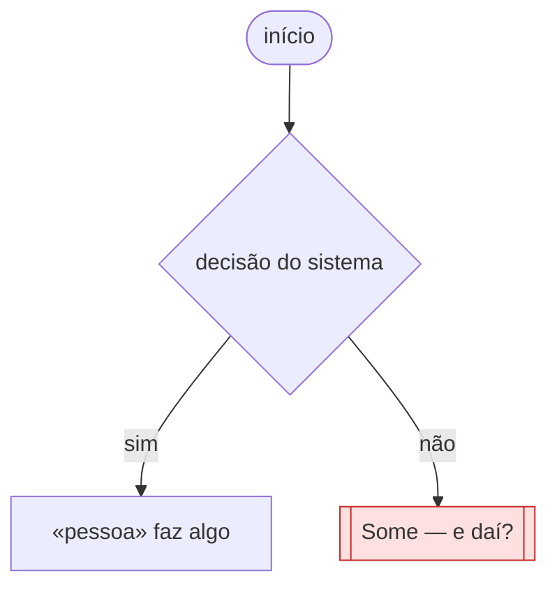

# 🗺️ Jornadas de Usuário

**Projeto:** [nome]
**Versão:** 0.0.0 · esqueleto — preencha via `/utf-flows`
**Última atualização:** [data]

> 🤖 **Este documento é a fonte da verdade sobre O QUE A PESSOA VIVE na tela** —
> o caminho do primeiro clique até o objetivo, e principalmente os pontos onde ela
> trava, espera ou desiste.
>
> ✍️ **Não preencha na mão:** rode `/utf-flows`. A entrevista escolhe a história que
> merece o desenho, obriga o ponto de desistência a aparecer e cobra a decisão sobre
> ele.
>
> 🚫 **Não duplique:** regra de negócio mora no `prd.md`; estado, entidade e contrato
> moram no `architecture.md`. Aqui mora o caminho.

---

## Jornada 1 — [nome da história]

**Story:** USnn
**Critérios que ela marca:** [sai do site e volta · depende do tempo · depende de outra pessoa · pode ser abandonada]

**O que decidimos sobre o nó vermelho:**

[Um parágrafo, com as palavras do aluno. O que o sistema faz quando a pessoa some ali?
É este parágrafo que transforma o desenho em decisão de projeto — e é ele que o
professor pede para explicar na defesa.]

---

## Dúvidas em aberto

| # | Dúvida | Onde ela precisa ser resolvida |
| --- | --- | --- |
